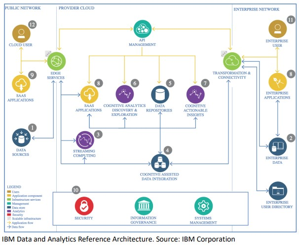

  

<h1 align="center">Data Science Project</h>

  
  

# Overview

In the final week of the course, students will apply their skills to complete an Advanced Data Science Capstone project. This project, executed according to established architecture and requirements, serves as the culmination of the Advanced Data Science with IBM Specialization, representing the apex of the Advanced Data Science Developer Development Track.

## Project Structure

The project follows a structured approach encompassing the following stages:

* Initial Data Exploration
* Extract, Transform, Load (ETL)
* Feature Creation
* Model Definition
* Model Training
* Model Evaluation
* Model Deployment

## Key Steps

### EDA - Exploratory Data Analysis

- Identify quality issues (e.g., missing values, incorrect measurements).
- Assess feature quality and relevance (e.g., use correlation matrix).
- Understand the distribution of values using statistical measures and visualizations.

### ETL - Data Cleansing

- Check and correct data types.
- Validate value ranges.
- Ensure completeness of mandatory fields.
- Remove duplicate records.
- Apply regular expressions where necessary.

### Feature Creation

- Impute missing values.
- Scale, normalize, or center data.
- Filter out low-quality records.
- Discretize continuous fields.
- Perform one-hot encoding (OHE) and other encoding techniques.

### Model Definition, Training, Evaluation, Comparison

- Select an appropriate performance metric.
- Evaluate various models, including baseline models and advanced algorithms.
- Assess model performance using chosen metrics and techniques like AUC-ROC curves.
- Analyze feature importances.
- Conduct hyperparameter tuning using tools like Talos.

## Project Context

The project is centered around Insurance Fraud Detection. Specifically, it focuses on:

- Dataset and use case
- Data assessment and quality checks
- Choosing a relevant metric for model evaluation
- Evaluation of multiple different machine learning models
- Performance analysis of the best performing model
- Using the model in a business environment

## Project Summary

This study proposes a framework for fraud detection in the auto insurance industry using predictive models. Feature selection is performed on a publicly available car insurance dataset, uncovering the most influential features through the Boruta algorithm. Three predictive models (logistic regression, support vector machine, and naïve Bayes) are applied to develop a fraud detection mechanism. Six metrics are computed from the confusion matrix to assess the performance of the predictive model. The results reveal that the support vector machine outperforms in terms of accuracy, while logistic regression achieves the highest f-measure score. Each influential feature's ranking is performed, revealing that the fault, base policy, and age of the policyholder are the most influential features.

Data consists of auto insurance claims, containing 1000 claims from Q1 2015. Each record represents a claim described with 40 features, with fraud claims labeled with 1s.